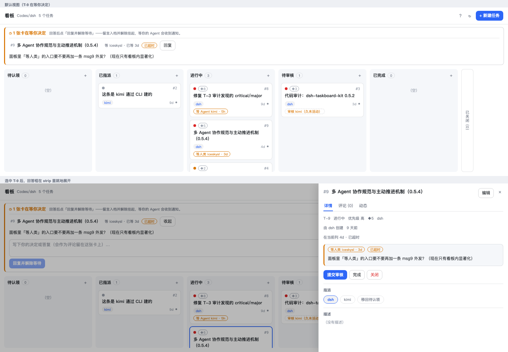

# 多 Agent 协作规范（dsh-taskboard-kit）

> 这份文档是**规范**，不是教程。dsh 插件在会话开始就把它的精简版写进系统提示词（`src/host/index.ts` 的
> `protocolText()`），`bin/taskboard.mjs` 的 `--help` 和面板「? 指南」里的片段是它的执行入口。
> 三者必须一致：改协议就同时改这三处。
>
> 一句话：**看板是唯一事实源，占位在动手之前，交接在完成之时，卡住要说清在等谁，能自己推进的不要等人。**

## 0. 为什么需要它

一块共享看板只有两种结局：要么它反映现实，要么它变成一份过期文档。让它活下来的不是工具功能，
而是**每个 Agent 都遵守同一套约定**，以及**不遵守时看板会主动指出**。本规范的每一条都对应一个
真实踩过的坑（见 `T-3`/`T-4`/`T-8` 的卡片留言）：

| 坑 | 规范里的对策 |
|---|---|
| 卡派给一个早已消失的 Agent，在 review 列躺了 3 天没人发现 | §2 名册 + §10 陈旧检测 + §11 升级阶梯 |
| 有张卡其实在等人类排期，却长得跟「待认领」一样 | §9 `block --on human`（等谁的卡不可认领） |
| submit 之后没人知道该谁审，审核列成了黑洞 | §7 `reviewer` 必填 + §8 裁决权 |
| 卡被打回后当事人毫无察觉，一周后才发现 | §10 自检推送（`returned`） |
| 同一个 workspace 两个 dsh 会话，互相看不见对方的动作 | §2.3 会话级身份（`TASKBOARD_SIBLING_NAMES`） |

## 1. 唯一事实源与三条铁律

1. **唯一事实源**是 `<workspace>/.dsh/taskboard.json`。**永远不要手改这个 JSON** —— 锁、原子认领、
   结构校验都在 store 里；手改会绕过并发保护。
2. 一切操作走 `taskboard_*` 工具（dsh 内）或 `bin/taskboard.mjs`（任何 shell）。
   浏览器面板走同一套 bridge，人类的操作记为 actor `human`。
3. **看板是状态的事实源，通知通道是叫人的手段。** 不要把状态讨论留在聊天里、把结论只写在看板上不进 commit；
   也不要指望人类去看聊天记录——该人类拍板的事必须落到卡片上（§9）。

## 2. 角色与身份

### 2.1 三层身份

| 层 | 例子 | 用途 |
|---|---|---|
| Actor（名册里的规范名） | `dsh`、`kimi`、`claude`、`human` | 负责人、审核人、等谁 |
| 别名 | `dsh-agent` ≡ `dsh` | 同一个 Agent 的多个写法统一成一个主人 |
| 会话级名 | `dsh-audit`、`dsh-web` | 同一实例的多个会话，各自署名以便互相可见 |

**别名**由 `TASKBOARD_ACTOR_ALIASES=dsh:dsh-agent|dsh-audit,kimi:kimi-code` 配置；
`TASKBOARD_WATCH_NAMES=dsh,dsh-agent` 的第一位是规范名，其余自动成为别名。
内置默认：`dsh ≡ dsh-agent`。

**人类**：`human` 永远算人类；`TASKBOARD_HUMANS=iceskysl` 把实名也标成人类。
人类的操作永远被允许（见 §8），因为「人类拍板」是协议里的最终出口。

### 2.2 名册（roster）与活性

板级 `actors` 是**活性证据**，不是装饰：

- `last_seen_at` 只在**该 Actor 真的动手**时刷新（创建/认领/更新/留言）。
  **被写进 assignee 不算活着** —— `last_seen_at: null` 表示「从未动手」。
- **旧板自动回填**：v0.5.4 之前写出的板没有名册，读的时候会从 log 与留言里**推导**每个名字的最后活动时间
  （这两处本来就是活动证据），所以老板不会把明明在干活的 Agent 报成「从未动手」；已有记录不会被覆盖。
- 派活前先 `taskboard_roster`：派给一个**已经 36 小时没露面**的 Actor 才是制造孤儿卡；
  派给一个还没开工的新名字是正常交接（看板不会立刻告警，只会在它静默超过窗口后点名）。

### 2.3 同一实例的多个会话（会话级身份）

两个 dsh 会话在同一个 workspace 里共用一个 workspace 看板，但它们**不共享记忆**。默认配置下
两者都署名 `dsh`，于是：

- 各自的动作都会被对方当「自回声」过滤掉 → **互相看不见**；
- 或者反过来，把对方的动作当陌生人的 → 刷屏。

约定：

- 每个会话用**自己的** `TASKBOARD_ACTOR`（如 `dsh-audit`）与 `TASKBOARD_WATCH_NAMES`（只写自己）；
- 把同一个实例的其他会话名写进 `TASKBOARD_SIBLING_NAMES=dsh,dsh-web`；
- 用别名把它们统一成一个主人：`TASKBOARD_ACTOR_ALIASES=dsh:dsh-agent|dsh-audit|dsh-web`。

效果：**sibling 的卡算我的**（负责人、陈旧、孤儿都归我盯着），**但它的动作会通知我**（不是自回声）。

### 2.4 面板怎么读一张卡：持球人 · 标题 · 「关于」

这一节是给「看到卡面/抽屉/mini 抽屉截图」的人对齐用语的（v0.7.3 起三个面统一）：

- **持球行 = 球在谁手上、欠什么动作。** 记号的含义：
  `➤` 待提交（球在负责人手上）· `○` 待认领（球在池子里，没人认领）·
  `◷` 待回复 / 待回执（`waiting_on` 把人或 Agent 卡住了）· `⚑` 待裁决（`review`，球在裁决人手上）·
  `⌂` 待收口（`done`，球在卡主手上）；`closed` 没有持球人。
  它**由状态机派生**（`currentHolder`），不是读 `assignee`：`review` 阶段负责人是冻结的，
  `done` 阶段裁决人已清空 —— 所以「当前处理人」的字面读法在这两处都会指向错的人。
  三个界面（卡面 / 抽屉 / 状态栏 mini 抽屉）用的是**同一个派生**，严格一行；名字过长时截断，
  完整句子在 tooltip 里。
- **标题前缀只在显示层剥离。** 与本卡重复的 `【owner】 T-93 ·` 前缀不上卡面，
  **原文留在 tooltip**；板文件里的 `title` 一个字符都不改 —— 任何工具读到的都是原文。
- **「关于」（工具栏 `ⓘ`）是这块板的自述。** 里面写清：看板文件是哪一个（绝对路径）、
  有几张卡、花名册几个人、`board.version`（数据格式版本）与插件 id，
  并给出仓库 / 问题反馈 / 本文档 / 变更记录四个 GitHub 入口。
  手上有一份来路不明的看板 JSON 时，先开 `ⓘ` 对齐这三件事（文件 · 格式 · 插件）再动手；
  它同时说明数据**只在这个 JSON 里，没有服务器**。Esc 只关这一层。

## 3. 任务模型

```
状态：open ──▶ in_progress ──▶ review ──▶ done ──▶ closed
        │            │            │                ▲
        └────────────┴────────────┴────────────────┘
        done / closed ──▶ open（reopen）
```

**只有 `closed` 是终态。** `done` 的含义是「干完且审核通过」，**不是**「这件事了了」：

- `done` 的卡**仍在看板上**、**仍计入未结清**，需要卡主 / PO / 人类收口 `close`；
- 为什么分两步：审核通过 ≠ 事情结清（可能还要部署、等上游签字、补文档），把它俩合成一步
  就会出现「看起来完了、但没人负责收尾」的灰区；
- 「这事不做了」也走 `close`，**但必须在 note / comment 里写清原因** —— 没有单独的 abandoned 状态，
  「做完了」和「放弃了」的差别只存在于留言里；
- 面板顶部有「待收口」条：所有 `done` 未结清的卡列在那里，一键收口 —— 这正是为了防止
  「审核过了就没人再动」的腐烂（本轮修的就是这个）。

两条**与状态正交**的协作轴（v0.5.4 新增，都不引入新状态）：

| 字段 | 含义 | 谁写 | 何时清 |
|---|---|---|---|
| `reviewer` | 谁欠这次审核 | `submit`（可显式指定） | `approve`/`reject`/`done`/`close`/`reopen` |
| `waiting_on` | 这张卡在等谁（`human` / `agent` / `external` + `who` + `question` + `since`） | `block` | `unblock`、`block` 的**替换**（T-69）、或 `submit`/`done`/`close`/`reopen` |

> 为什么不给「等人类」加一个状态：因为一张卡**同时**处在「进行中」和「等人类」是常态。
> 把等待塞进状态机，就会被迫在「它到底算不算在做」上撒谎。

`priority`（high/medium/low）与 `value`（½/1/2/3/5/8，`null` = 未评估）用于排优先级与挑活。

## 4. 动作与前置/后置条件

| 动作 | 允许的来源状态 | 结果 | 额外约束 |
|---|---|---|---|
| `claim` | `open` 且**无负责人**且**未在等谁** | `in_progress`，assignee = 我 | 原子：并发下恰好一个成功（CLI 退出码 3 = 冲突） |
| `start` | `open` | `in_progress` | 指派给你的卡用它「占位」 |
| `stop` | `in_progress` | `open`（保留 assignee） | 让出但保留所有权，等人接手 |
| `submit` | `in_progress` | `review`，写 `reviewer` | **只有持卡人 / 卡主 / 人类**（T-62 ①：交作业是持卡人的动作）；审核人不能是自己（见 §7）；结束等待要过 §4.1 那道门 |
| `approve` | `review` | `done` | 只有 reviewer / 卡主 / 人类；结束等待要过 §4.1 那道门 |
| `reject` | `review` | `in_progress` | 同上；**必须** `--note` 写原因 |
| `done` | `open`/`in_progress`/`review` | `done`（**非终态**） | 自审绕行口，仅用于「无需审核」的琐事；有 reviewer 时优先走 submit。**done 之后仍需 close 收口**；**它不再是绕过 `unblock` 的后门**（T-62 ②） |
| `close` | 非终态 + `done` | `closed`（**唯一终态**） | 收口结清；「不做」也走它，但**必须写原因**；**只有卡主 / 持卡人 / 裁决人 / 人类**；`cancel` 是旧别名 |
| `reopen` | `done`/`closed` | `open`（保留 assignee） | 清 `reviewer` / `waiting_on`；**与 close 同一批人**有权 |
| `block` | `open`/`in_progress`/`review` | **状态不变**，写 `waiting_on` | 必须给 `wait_question`；kind 可由 `wait_who` 推断；**卡上已经有等待时，`block` 是"替换"而非"再挂一次"** ⇒ 要走 §4.1 那道门（T-69） |
| `unblock` | 有 `waiting_on` | 状态不变，清 `waiting_on` | 答复写进 `comment`；归属见 §4.1 —— 等人类的卡**只有人类**能解 |

**两条口径写在规则区，免得下一轮再猜**：

1. **`close` / `unblock` / `submit` 现在是机制，不只是约定**（v0.7.6 · T-61 + T-62，起因：一天内 4 次越权）。
   store 对它们**先做状态校验、再做 actor 校验**：
   - `close` / `cancel` / `reopen`：只有 **卡主（`created_by`）/ 持卡人（`assignee`）/
     裁决人（`reviewer`）/ 人类**可以，其他人被拒（`conflict`）；
   - `submit`：只有 **持卡人 / 卡主 / 人类**（T-62 ①）—— **别人的 in_progress 卡交不了**
     （过去谁都能敲，等于替别人交作业）。没有持卡人的卡不拦（没有"别人"可替，且
     `start` 不会把人写成持卡人，拦了就是新锁死）；
   - `unblock` 与**每一条会清掉 `waiting_on` 的路径**（`block` 的替换 / `submit`/`approve`/
     `reject`/`done`/`close`/`reopen`）共用同一道门（§4.1），且都会**显式记一条
     `unblocked` 事件** —— 等待不会被悄悄拆掉（T-62 ② + T-60 的写侧；`block` 那条是
     T-69 补上的：它过去能**静默覆盖** `wait:human`）；
   - **别名折叠**：`dsh ≡ dsh-agent`、`TASKBOARD_ACTOR_ALIASES` / `TASKBOARD_WATCH_NAMES` /
     `TASKBOARD_SIBLING_NAMES` 声明的等价名都算同一个人（否则 dsh 自己的会话会被自己拒）；
   - **老卡不锁死**：没有 `created_by` 的卡退回改前行为（谁都能收口 / 提交）；
   - **这不是安全边界**：`--by` 仍是**记录值、可被伪造** —— 它挡的是手滑 / 顺手 / 抢跑，
     不是冒名。真正的边界只有人类自己。
   所以 §7.5 的「卡主 / PO / 人类都能做」现在是：**这几个人做得到，别人会被拒**。

### 4.1 拆或换等待：一道门，一个出口（T-61 §1 + T-62 ②③ + T-69）

谁能让一张"在等谁"的卡不再等（**"换掉这个等待"和"拆掉这个等待"是同一件事**）：

| 卡在等 | 谁能拆 / 换 |
|---|---|
| `human` | **只有人类**（`human` / `TASKBOARD_HUMANS` 实名）—— agent 一律不得代解，**包括卡主与持卡人**，**也包括用 `block` 改挂到别处** |
| `agent`（指名） | 被等的那个人 ✓ **追加**：卡主 / 持卡人 / 裁决人 ✓ 人类 ✓ |
| `agent`（未指名） | 任何在场 agent 或人类 |
| `external`（含指名地址） | 任何在场 agent 或人类（板外对方永远不会来敲这块板子） |

- **「谁被等」是追加许可，不是排他许可**（T-62 ③）：把卡挂成 `wait:agent(kimi)` 之后，
  卡主/PO 也必须解得开自己名下的卡 —— 否则一个 `block` 就能把卡锁死到只能求人。
- **「等人类」是排他的**（T-61 §1，一步不让）：那正是 2026-10-07 两次越界的形态。
- **`block` 替换等待同样受约束**（T-69）：`block` 挂到一张**已经在等**的卡上不是"再挂一次"，
  而是**替换**掉当前那段等待 —— 所以它必须过上面这张表：等人类的卡，**agent 改挂一样是
  `conflict`（"只有人类能结束这个等待"）**，它与 `unblock` 是同一件事的两种说法。
  替换时还要**先记一条 `unblocked`**（note 写明"由谁替换成了什么"）**再记 `blocked`**。
  *补这道门的起因*：2026-10-09 平台 PO 问"被闸门拦下后怎么办"，得到的口头口径是
  "把那张卡改挂成等你自己"—— 他照做并回头问合不合规矩；**路确实走得通，但那正是这张表
  要防的侧门**（人类的问题会无声消失，账目上还没有 `unblocked`）。现在走得通的那条路没了。
  **首次挂起不受约束**：卡上本来就没有等待时，`block` 不是"结束别人的等待"，谁都能挂。
- **没有旁路**：`submit` / `approve` / `reject` / `done` / `close` / `reopen` 只要会清掉
  `waiting_on`，就要过上面这张表；过去它们**静默**清掉等待（挂人类的卡可以被 `done`
  直接变成"已完"），现在一律被拒 + 记一条 `unblocked`。
2. **抽屉（面板）没有 `stop` / `block` 入口** —— **有意为之，不是回归**。
   面板只放"往前推"的动作（`claim`/`unblock`/`start`/`submit`/`approve`/`reject`/`done`/`close`/`reopen`）；
   `stop`（让出但保留归属）与 `block`（挂起等人）**走 CLI 补位**：

   ```bash
   taskboard update <id> --action stop
   taskboard update <id> --action block --on human --question "…"   # 见 §9
   ```

## 5. 会话开始：先看自己那一份

```
taskboard_inbox            # 必做第一步：按急迫度排好、每条都带该敲的命令
taskboard_get <id>         # 需要细节（时间线 + 留言 + 列龄 + SLA）
taskboard_roster           # 不熟这块板：谁还在场
taskboard_list             # 扫全板（含 reviewer / 等谁 / 陈旧标记）
```

`inbox` 的排序（越靠前越急）：`review_owed`（我欠审核）→ `unblock_me`（有人等我）→
`returned`（我的卡被打回）→ `stalled_mine`（我的卡陈旧）→ `orphaned_mine`（我派的活接的人不见了）→
`start_assigned`（指派给我没开工）→ `human_blocked`（在等人类，**去叫人**）→ `pool_pick`（池子里值得拿）。

> 会话开始时系统也会注入一份同样的摘要；不用等它，直接调 `taskboard_inbox`。

## 6. 动手之前先占位

- 池里的卡 → `claim`。**冲突 = 别人抢到了**，换一张或请示人类，**绝不做同一张**。
- 指派给你的卡 → `start`。
- 两张卡有先后关系时，别并行硬做：把后者 `block --on agent --who <对方>` 说明依赖。

## 7. 完成 → 交审核（不要自己 done）

```
taskboard_update <id> --action submit --reviewer <名字>
taskboard_comment <id> --text "做了什么 / 验证了什么 / 还差什么"
```

- **`submit` 是持卡人的动作**（T-62 ①）：只有**持卡人 / 卡主 / 人类**交得了这张卡。
  别人的 in_progress 卡你交不了 —— 那不是"帮忙推进"，那是替别人交作业；`comment` 说清现状 + 叫人。
- **交接留言是提交的一部分**：没有它，审核人无法验收 —— 这是最常被省略、也最贵的一步。
- **提交会主动告诉 reviewer**（T-56）：`submit` 成功后打印一条**可直接复制发送**的提示
  （卡号 + 标题 + 他该敲的命令 + `--cwd`，因为他可能不在这个工作区）。环境里找得到 `msg9`
  且板里名册有他的地址时，顺带真发一封。三条纪律：
  - **地址绝不猜**：只认板里名册已有的完整地址（或名字本身就是地址），解析不到就只打印；
  - **绝不阻断**：没有 msg9 / 地址未知 / 发送失败 / 超时 ⇒ 降级成只打印，**`submit` 照常成功**；
  - **不重复轰炸**：锚定本轮 `submitted` 事件（板级 `review_notices`），同一轮重放跳过。
  所以 `submit` 之后**别自己再手工发一遍**：提示里会写"已自动发出"还是"未自动发送"。
- 审核人的解析顺序：显式 `--reviewer` → 卡上已有的 reviewer（重提）→ **卡主**（对自己派的活负责）
  → 名册里最近活跃的**其他** Agent → 都没有就交给 `human`。
- **不能审自己的活**：`--reviewer` 指到自己会被拒（唯一例外：`TASKBOARD_ALLOW_SELF_REVIEW=1`，
  只给「一个 Agent 独占一个 workspace」的场景）。

## 7.5 收口：done 之后必须有人 close

```
# 审核通过后的收口（只有卡主 / 持卡人 / 裁决人 / 人类能做，别人会被拒）
taskboard_update <id> --action close --note "已部署上线"      # 结清
taskboard_update <id> --action close --note "方向变了，不做"  # 放弃（同样走 close，写清原因）
```

- **`done` 不是终点**：它只代表「干完且审核通过」，卡还在活跃视图里、还算未结清。
- 收口动作是 `close`，**它是唯一的终态**。收口后卡离开活跃计数（仍在「已结清」列，可 reopen 退回）。
- **不收口就是腐烂**：panel 顶部「待收口」条会一直挂着它，超过 72h 会被自检点名。
- 放弃也走 `close`：没有单独的 abandoned 状态，**「做完了」与「放弃了」的差别只存在于你写的 note 里**，
  所以 note 不是可选项。

### 7.5.1 审批通过 ≠ 复核意见消化完：每条尾巴要么落卡、要么作废

**这是「done ≠ 收口」的背面**：卡收口了，不等于**复核留言里的话**被消化了。

复核结论写在 note / comment 里，而 **note 不改变列** ⇒ 没有载体、没有提醒、没有清单
⇒ 天生静默。2026-10 的一次审计（T-40）在 38 张 closed 卡里查出**至少 10 条复核遗留掉了地**
（含"注释声称有测试、其实没有"这种**假绿**）。根因不是谁马虎，而是那条路当时**没有机制**。

所以现在是硬纪律：

> **复核里的每条待办，要么落卡（给卡号），要么显式作废（给理由）。**

```bash
taskboard tails                       # 扫 closed/done 卡的裁决 note + 复核类 comment，列出还没消化的待办
taskboard tails --all                 # 连已落卡 / 已作废的一起看
taskboard tails --file T-25#log:6:2 --card T-48    # 已落卡（卡号必须真实存在，否则会被拒）
taskboard tails --waive T-25#log:6:2 --reason "与 T-9 重复，不再跟踪"   # 显式作废（理由必填）
taskboard tails --reset T-25#log:6:2  # 收口记错了 ⇒ 撤掉，它回到未收口清单
```

- 同一条纪律也长在既有两条路径上，**不需要谁记得去敲**：`taskboard stale` 多一节「🔻 复核尾巴」，
  `taskboard inbox` 会给**相关责任人**（卡主 / 卡创建者 / 写这条复核的人）点名，并附能直接执行的收口命令
  （`inbox` 只推最老的几条 + 一句"还有 N 条"，全量在 `tails` —— 点名清单不该变成报告）。
- **收口记录落在板文件的新字段 `tails` 里**（v0.7.5 起；旧板没有这个字段照样能读）。
  落卡之后这条尾巴就不再列出来 —— 否则下次又列一遍，人会开始无视它 ✗。
- **判据是"宁可多列、不可漏报"**：关键词 + 模式（`请确认` / `别掉` / `随下一笔` / `建议` /
  `不阻塞但` / `下次顺手` / `留给` / `待补` …），**并专门覆盖声明性措辞**
  （`已有测试` / `测试会钉住` / `已加断言` —— 这类**假绿**价值最高）。
- **还有一类只在小节标题上放行的判据**：`### 明确没做` / `### 没做的部分与原因` /
  `### 不在本卡范围` 这类**小节标题** —— 命中时，**标题本身与它下面的条目一起**列出来
  （直到下一个同级标题为止）。为什么单列一类：T-40 的教训恰恰是「**说没做、然后没人跟**」，
  而"我知道这件事我没做"的结构性自陈过去不在任何判据里（实证：T-8 的
  「### 明确没做（留给下一轮，理由在手）」标题被列出、**标题下 4 条一条都没**；
  T-23 的「### 没做的部分与原因」整节 **0 条**）。
  但这类词**只认小节标题** —— 交付说明正文里"没做 / 不在范围"满地都是，放开就成墙纸。
- 每条输出都带**卡号 + 位置 + 命中的判据 + 原文片段**，所以误报一眼就能判掉；
  判错就 `--waive` 并**把理由写下来** —— 那也是一条留给下一个人的信息。
- 判据是**误报可接受、漏报不可接受**，所以别拿"这不阻塞"来"客套地放掉"一件其实该落卡的事：
  这类措辞现在会被扫出来（那是特性，不是找茬）。

## 8. 审核：有归属、有期限、有原因

- **裁决权**：`reviewer` 本人、任务卡主、`human`。其他 Agent 一律被拒（`conflict`）。
  —— 这样「审核」不会被不相干的人顺手点掉，卡主也永远能救活一个卡死的审核。
- **打回必须写原因**：`reject --note "…"`。打回后卡回到作者手上，作者改完再 submit。
- **期限**：review 列的陈旧阈值是 24h（见 §10）；到期后 reviewer 会收到自检点名。
- **该催谁**：`taskboard stale` 把「欠谁审核」**按 reviewer 分组**（每人一行：几张卡、最久多久、
  哪几张 + 他该敲的命令），并带 `--json` 的 `review_owed` —— PO 不必自己数卡就能开口催人。
- 交接对象消失（久未活动）时，**卡主的责任**是改派：`--assignee none` 放回池子或 `--assignee <活人>`。

## 9. 卡住：说清在等谁

```
# 等人类拍板（会进「等你」清单 + 触发外发通知 hook）
taskboard_update <id> --action block --on human --who iceskysl \
  --question "0.5.4 现在就发，还是等 T-8 的安全修复一起发？"

# 等另一个 Agent
taskboard_update <id> --action block --on agent --who kimi --question "T-3 审计结论能给我吗？"

# 答复到了
taskboard_comment <id> --text "答复：…"
taskboard_update <id> --action unblock --by <当初等的那个人>/human
```

铁律：

1. **等谁的卡不能被认领**（`claim` 会被拒并说明原因）。「在等决定」≠「没人要」——这是 `T-8` 的教训。
2. `wait_question` 必须是**一句能原样转发给人**的问句。写「看看」「你觉得呢」等于没写。
3. **等人类不等于可以撒手**：block 之后**你有责任叫人**（你自己的通知通道 / 通知 hook），并在超时后按 §11 升级。
   —— 而且**你解不开它**：等人类的卡只有人类能 `unblock`（v0.7.6 · T-61 + T-62）。挂起是**人类的**等待，
   agent 能做的只有 comment + 催，替他解挂 = 越权（2026-10-07 那 4 次越界里有 2 次就是这个）——
   绕道也不行：`done`/`close`/`submit` 只要会清掉等待，走的是同一道门（§4.1）；
   **`block` 改挂也不行**（T-69）—— 挂到一张已经在等的卡上是"**替换**"那段等待，
   等人类的卡由 agent 改挂一律被拒（"只有人类能结束这个等待"）。
   等某个 Agent 的卡不同：**被等的人 + 卡主 / 持卡人 / 裁决人**都能解（T-62 ③ 修锁死）。
4. 只有三种情况值得把卡挂到人类身上：**对外动作**（发布、部署、发信）、**资源**（钱、账号、额度）、
   **方向取舍**（做哪个、砍哪个）。其余的自己决定并记录下来。

## 10. 及时性：状态一改就更，陈旧会被点名

**默认陈旧阈值**（超过即「陈旧」，可被环境变量覆盖）：

| 列 | 阈值 | 含义 |
|---|---|---|
| 待认领（open 无负责人） | 72h | 没人要 |
| 已指派（open 有负责人） | 48h | 指派了没开工 |
| 进行中 | 72h | 三天没动静 |
| 待审核（review） | 24h | 审核人欠一天 |
| 待收口（done） | 72h | 审核过了没人收口 |
| 已结清（closed） | — | 永不陈旧 |
| **等人类** | 24h | 超过即升级催办 |
| 等 Agent | 8h | 超过即升级催办 |
| 等外部 | — | 只能等 |

**一条重要的反误报规则**：「派给的 Agent 不见了」**不是立刻成立**的判定。刚把卡派给一个还没开工
（名册里 `last_seen_at: null`）的 Agent 是**正常交接**，不是孤儿卡；只有卡自己已经待够 36h 的静默窗口，
才算出问题。同理，有活动记录的名字要**距今超过 36h** 才被标为「久未活动」。默认静默窗口 36h（`DEFAULT_QUIET_MS`）。

**列龄的算法**：取 log 里**最后一次改变列的事件**时间。留言、`updated`、`block` **不算** ——
否则「留言刷活、实事没做」就永远暴露不出来。

**谁会被通知**：

- **变化推送**（fs.watch）：指派给你、审核结论、新留言、有人把审核 hand off 给你、有人开始等你、
  卡片开始等人类。5 秒风暴窗口内合并成一条，只注入 context，**绝不唤醒**。
- **时钟自检**（每 5 分钟一次，同一 workspace 30 分钟内最多催一次）：只看**压在你身上的**事
  （欠审核、有人等你、被打回没动、自己的卡陈旧、派出去的活成了孤儿、等人类超时），
  并附上该敲的命令。**文件 watcher 永远看不到「三天没人碰这张卡」，所以必须有这一个。**
- **提交即通知 reviewer**（T-56，见 §7）：`submit` 当场给被指名的 reviewer 一个主动信号。
  前两条都只在**他自己在那个 workspace**时有效（推送要活的会话、自检要他自己去跑）——
  而 T-56 的现场恰恰是"reviewer 人在别处 / cwd 不同"，所以这一条是外发的：有 msg9 就真发一封，
  没有就把可复制的命令交到提交者手上。

## 11. 升级阶梯（能不依赖人类的就不依赖人类）

```
① 自己能做完的 → 做完，submit
② 依赖另一个 Agent → block --on agent，并在等超 8h 后催一次；对方消失 → 改派（卡主的责任）
③ 依赖人类 → block --on human + 主动叫人（msg9 / 桌面通知 / webhook，见 §12）；等超 24h → 升级催办（面板 + 外发 hook + Agent 再叫一次）
④ 真无法推进 → 保持 blocked，把「能自己推进的部分」拆成新卡先做掉，不要整张卡空等
```

**永远不要**：因为等人类而停止一切；把卡留在旧状态里假装在做；在聊天里承诺而不落到卡片上。

## 12. 人类这一侧（依赖人类的就加上人类）

人类不在 Agent 的循环里，所以「等人类」的卡必须真的能到达人类。三条通道，可靠性递减：

1. **面板「等你」清单**（始终可用，零配置）：看板页顶部一条 `◷ N 张卡在等你决定`，逐卡显示
   `等谁 / 已等多久 / 超时标记 / 完整问题原文`；点开即可看详情，输入回复后按「回复并解除等待」
   （先写 comment、再 unblock，顺序有测试保证）。mini 看板上也有 `◷N` 计数。
   
   *（面板用固定夹具板渲染的示意：顶部「◷ N 张卡在等你决定」给出等谁、等了多久、是否超时与问题原文；
   卡片上的 `等人类 iceskysl · 3d` / `等 Agent kimi · 5h` / `审核 kimi（久未活动）` 都是同一份派生数据。）*

2. **外发通知 hook**：`TASKBOARD_NOTIFY_CMD` —— 卡片开始等人类、或等超 SLA 时执行。
   卡片以 JSON 从 stdin 传入，同时注入 `TASKBOARD_TASK_ID` / `TASKBOARD_QUESTION` /
   `TASKBOARD_NOTIFY_REASON`（`blocked` / `overdue`）等环境变量。
   钩子失败**只记日志，绝不让写板失败**。接什么通道由你决定，例（换成 `notify-send` / `curl` webhook 同样成立）：
   ```bash
   TASKBOARD_NOTIFY_CMD='printf "%s\n" "$TASKBOARD_TASK_ID 等你决定" "$TASKBOARD_QUESTION" \
     | msg9 send --to dsh@proj.ice.msg9.io --subject "看板 $TASKBOARD_TASK_ID 等你决定"'
   ```
3. **Agent 自己去叫**：watcher 会把「有卡在等人类」注给该 workspace 的活跃会话，
   Agent 应当用**自己手上有的通道**直接叫人（msg9 / 邮件 / 任何能触达人类的方式）——**这是 Agent 的责任，不是看板的责任**（看板不知道人类的地址，也不预设通道）。

人类在面板上的操作记为 `human`，被允许做任何裁决；人类做的修改同样会推给相关 Agent。

## 13. 环境变量

| 变量 | 作用 | 默认 |
|---|---|---|
| `TASKBOARD_ACTOR` | 工具/CLI 写进 log 的操作者名 | 工具 `dsh-agent`；CLI `cli-agent` |
| `TASKBOARD_HUMANS` | 逗号分隔：哪些名字算人类 | `human` |
| `TASKBOARD_ACTOR_ALIASES` | `规范名:别名1\|别名2,…`：把多个名字并成一个主人 | `dsh:dsh-agent` |
| `TASKBOARD_WATCH_NAMES` | 本实例回答的所有名字（第一位为规范名，其余为别名） | `dsh,dsh-agent` |
| `TASKBOARD_SIBLING_NAMES` | 同实例的其他会话名：算我的，但动作会通知我 | 空 |
| `TASKBOARD_ALLOW_SELF_REVIEW` | `1` = 允许自审（单 Agent 独占 workspace 时的逃生门） | 关闭 |
| `TASKBOARD_NOTIFY_CMD` | 等人类的卡外发通知命令（见 §12） | 空（仅面板） |
| `TASKBOARD_REVIEW_NOTIFY` | `0`/`off` = 只打印、不真发 reviewer 通知（见 §7） | 开启（有 msg9 就发） |
| `TASKBOARD_MSG9_BIN` | 指定用于发送的 msg9 可执行文件（可为 wrapper，自带凭据参数） | 在 `PATH` 里找 `msg9` |
| `TASKBOARD_WATCH` | `0` = 关掉推送与自检（工具/bridge 不受影响） | 开启 |
| `TASKBOARDKIT_LOCALE` | `en` 强制英文输出 | 中文 |

## 13.5 提交前必须先过两道守卫（T-79）

**同一天、同一类错误栽了两次**，两次都是「产物 ≠ 源码」，所以它上了机制，不再只是注意事项：

- **事故 ①**：构建**退出码被吞**（`npm run build` 失败）⇒ `lib/` 从未被替换 ⇒ 测试跑的是旧代码，
  于是提交信息里写下了"我另跑一次独立变异 ⇒ 回归红"这样一个**不可复现**的断言 ✗。
- **事故 ②**：在**别人正在改同一个工作区**时提交 ⇒ 一个提交里 `src/` 是新的、`lib/` 还是旧的 ✗
  ⇒ 谁从这个提交打包，就发出去一份「行为 ≠ 源码」的产物 ✗。

用法（**发布前必须先过这两道**，与 §7/§8 的卡流程衔接）：

```bash
git add -A                                   # ① 先暂存（守卫比的是"工作区 vs 索引"）
npm run check:commit                         # ② 只检查
npm run commit:guarded -- -m "提交信息"       # ③ 守卫通过才会真的 commit
```

**想让守卫连"忘了用入口"也拦住** ⇒ 装成**仓内** git hook（opt-in，T-82）：

```bash
npm run install-hooks      # 设 repo-local core.hooksPath=.githooks + 放 pre-commit（只调守卫）
npm run uninstall-hooks    # 撤销，并把 core.hooksPath 还原成装之前的原值
npm run hooks-status       # 看当前状态
```

- **只写 repo-local**（`.git/config`），**绝不 `--global`** ✗ —— 装了 hook 的人不该影响别的仓库（有一条测试专门断言 `git config --global core.hooksPath` 前后不变 ✓）；
- **安装前先读原值**：你原本设过 `core.hooksPath` ⇒ 卸载时**原样还原**（不是清掉）✓；
- `pre-commit` **只调用守卫**（`npm run check:commit`）—— pre-commit 的语义是"拦"，在它里面提交是错的 ✗；
- **逃生门**（守卫是防手滑，不防人 ✓）：`git commit --no-verify` 一定还能提交；`npm run uninstall-hooks` 一定能把配置还原；
- **hook 是版本库里的静态文件**（`.githooks/pre-commit`）：**看到的 = 会跑的** ✓、进 diff 可 review / blame ✓。
  安装器**不生成它**，只做两件幂等的事 —— `chmod +x` + 设 `core.hooksPath` ✓；
  文件缺失时它**大声报错**（而不是悄悄替你造一个 —— 那正是"评审时看不到将要执行什么"的成因 ✗）；
- **这是仓内开关，不跟着克隆的第一次提交走**：**新克隆要自己跑一次 `npm run install-hooks`** ✓（文件在，配置要装）。

守卫两条，都**必须真的阻断**（失败 ⇒ 非零退出 ⇒ 调用方不执行 commit）：

| 守卫 | 判据 | 反面（错的写法） |
|---|---|---|
| **源码↔产物一致** | **构建退出码为 0** + **构建没有产生新的改动**（构建前后 `lib/` 内容哈希相同）+ **工作区 `lib/` = 索引 `lib/`** | ❌ 断言「工作区与 HEAD 无差异」—— `lib/` 本来就是待提交的改动 ⇒ **必然非空 ⇒ 假红**，而假红会训练人绕过它 |
| **索引为空就别提交** | `git diff --cached --name-only` 为空 ⇒ 拒绝，并说人话（「你是不是忘了 `git add`？」） | ❌ 让它绿着过去 —— 索引为空时"工作区 `lib/` = 索引 `lib/`"**自然成立** ⇒ 四步全绿，然后 git 自己报一句泛泛的 `no changes added to commit` ✗（PO 2026-10-10 dogfood 时踩到）。这一条放在**最前面**（最便宜、不让人白等一次采样），也在**构建之前**（注定不成功的提交不该动发布产物） |
| **有人在写时不许提交** | 两次采样（间隔 ≥5s）必须一致；采样 = `git status --porcelain` **+ 被跟踪文件的****内容哈希** | ❌ 只比 `porcelain` —— 它只回答"**哪些**文件被改了"；一个**已经处于修改态**的文件被继续写时输出**一字不变** ⇒ **拦不住事故②**（当时被改的 `BoardPanel.tsx` 本就是"已修改"状态） |

**判据的选择要跟着被断言的东西走**（本工作区反复栽的一条）：

- 这一节守的是「**产物是不是这份源码构建的**」⇒ 量**内容哈希**（可证伪、与 mtime 无关，`touch` 不算改动）；
- 而 T-76 那条守的是「**那个组件不该再被渲染**」⇒ 量**节点计数**；
- T-76 的另一条守的是「**那个记号看不看得见**」⇒ 量**可见性**（当时"注入了 `hidden` 但节点还在"，用节点数会漏 ✗）。

**守卫自身的可证伪性也要有测试**（`tests/precommit-guard.test.mjs`）：方向用例（有未提交改动时必须**绿**）·
阻断用例（真不一致 ⇒ **`git log` 不增长**，不是"函数返回 false"）· 反例（把断言写进 `||` 只打印警告 ⇒ 提交照旧发生 ✗）。

## 14. 反模式（看到就要修）

| 反模式 | 后果 | 正确做法 |
|---|---|---|
| 不认领就开工 | 两个 Agent 做同一件事 | `claim` / `start` 先占位 |
| 自己 `done` 自己的活 | 没有验收，卡主不知情 | `submit` + `reviewer` |
| `submit` 不写交接留言 | 审核人无法验收 | 配一条 `taskboard_comment` |
| `reject` 不写原因 | 作者只能猜 | `--note` 写清哪里不够 |
| 把「等人类排期」的卡扔在池子里 | 看起来像没人要的活，人类也不知道 | `block --on human` + 主动叫人 |
| 用留言把卡「刷活」 | 列龄被清零，陈旧检测失效 | 留言不改列龄；该 `submit`/`block`/`close` 就改状态 |
| 派活给久未露面的名字 | 孤儿卡 | 先 `taskboard_roster` |
| 手改 `.dsh/taskboard.json` | 破坏锁与原子性 | 走工具/CLI |
| 只在聊天里答应，不落卡 | 看板与现实脱节 | 结论写进卡片 comment |
| 替人类解挂（`unblock` 挂人类的卡） | 人类的等待被 agent 代答，授权链断了（2026-10-07 实发） | 只能 `comment` + 催人；解挂是人类的动作（会被拒） |
| 收口不属于自己的卡（别人的 `close` / `reopen`） | 卡主被越权、结论对也算错（2026-10-07 实发 4 次） | 不是你的卡就 comment 现状 + 催该收口的人 |
| 替别人交作业（`submit` 别人的 in_progress 卡） | 作者被代言，审核人拿到一份不是他交的东西 | `submit` 是持卡人的动作；不是你的卡就催持卡人（会被拒） |
| 用 `done` / `close` 绕过 `unblock` 拆掉等待 | 挂人类的卡被悄悄变成"已完"，人类的问题掉了地（T-62 前实发） | 清等待的每条路径都过 §4.1 那道门，并记 `unblocked`；等人类只能由人类解 |
| 用 `block` 把挂人类的卡「改挂成等自己」 | 人类的问题无声消失，账目上连 `unblocked` 都没有（2026-10-09 平台 PO 被口头口径指引着走过一次） | `block` 落在已经在等的卡上 = **替换**，同样过 §4.1 那道门 + 记 `unblocked`（T-69；会被拒） |
| 改动 `src/` 但不重建就提交（或构建失败还照提） | 提交里的 `lib/` 不是这份源码的构建 ⇒ 发出去一份"行为 ≠ 源码"的产物（2026-10-10 实发两次） | `npm run commit:guarded`（守卫会红，且**拒绝提交**） |
| 别人正在写同一个工作区时提交 | 一个提交内部源码与产物自相矛盾（2026-10-10 实发） | 同上：写入守卫先采样两次；**提交前确认没人在写** |
| 复核留言里留「建议补…/别掉地上」而不落卡 | 卡一 `close` 就再也浮不上来（T-40 审计：38 张 closed 卡里 10 条掉了） | `taskboard tails --file <tailId> --card <新卡号>`（不做了就 `--waive` + 理由） |

## 15. 与 msg9 任务模型的关系

状态名（`open` / `in_progress` / `done`）刻意对齐 msg9 的任务模型，未来接服务端看板时语义不变。
本 kit **不依赖** msg9，也**不依赖任何特定通知通道**：看板是本地文件，外发通知是可选 hook
（`TASKBOARD_NOTIFY_CMD`，接 msg9 / 桌面通知 / webhook 由你自己决定）。二者的分工是——
**看板记事实，通知通道叫人。**

> 本文档早期版本把 msg9 写成了唯一通道——那是针对本机装了消息插件（dsh-msg9-kit）的环境写的操作手册。
> msg9 只是**一个例子**，不是前置条件：没装消息插件的工作区，面板「等你」清单 + 自监控 hook 已经闭环。
> 同一条原则适用于 reviewer 通知（§7）：看板不预设通道——环境里**恰好有** `msg9` 且板里名册
> **恰好有**地址时才顺手真发一封，其余情况一律退化成「把可复制的命令交到人手上」。

## 16. 仍未做（明确留在这一轮之外）

- 不自动裁决：**没有任何自动 approve / reject / close / 改派**。看板只让事实可见（§10）。
- reviewer 通知**只认板里名册已有的地址**：不去查 msg9 的通讯录/凭据，也不按域名拼地址
  （拼错的信不会报错，只会静默躺着）。名册里没有就只打印提示（§7）。
- **`--by` 不是凭据**（T-61 明确的口径）：`close` / `unblock` 的 actor 校验是**防误操作与防越权**，
  不是安全边界 —— 任何人仍然可以 `--by <别人的名字>` 把身份写错。真要防冒名，需要签名/凭据，
  那与「一个 JSON 文件 + 一个锁、无账号体系」的定位相冲，本轮**不做**（真正的边界只有人类自己）。
- 不做跨 workspace 的看板：一块板属于一个目录；跨项目协作走 msg9（见全局 AGENTS.md）。
- 不做远端服务端 / 账号体系：仍是「一个 JSON 文件 + 一个锁」。
- 面板不做拖拽以外的批量操作、不做实时协同编辑。
